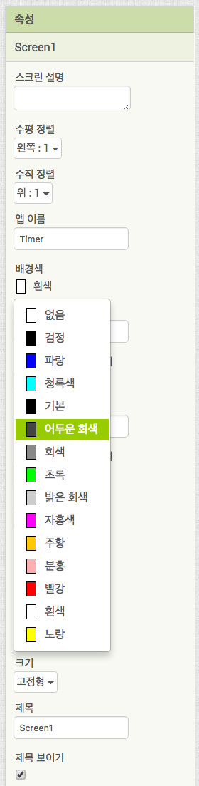
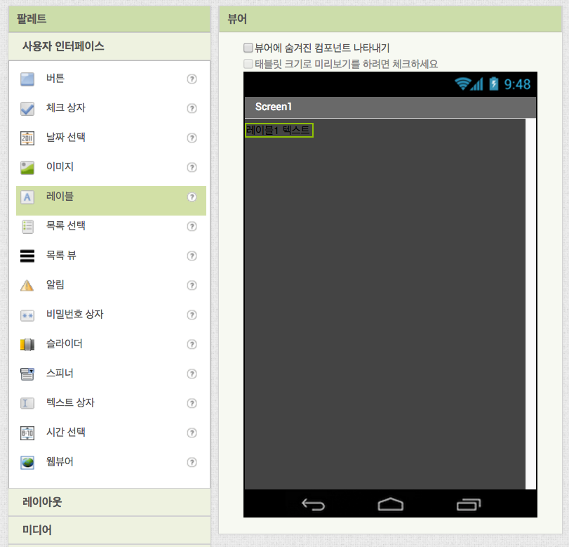
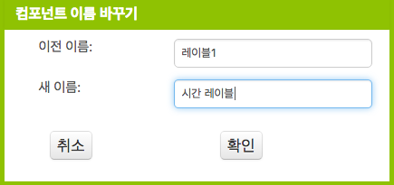
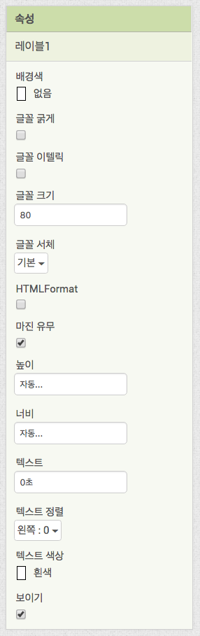
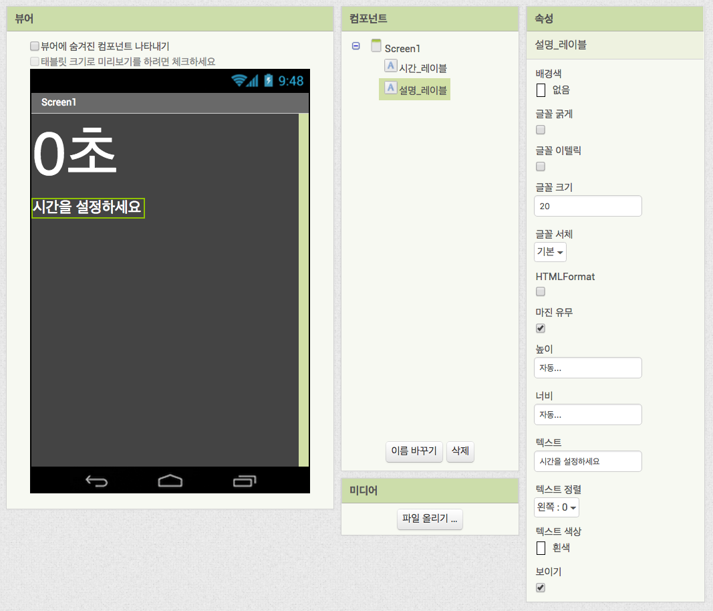
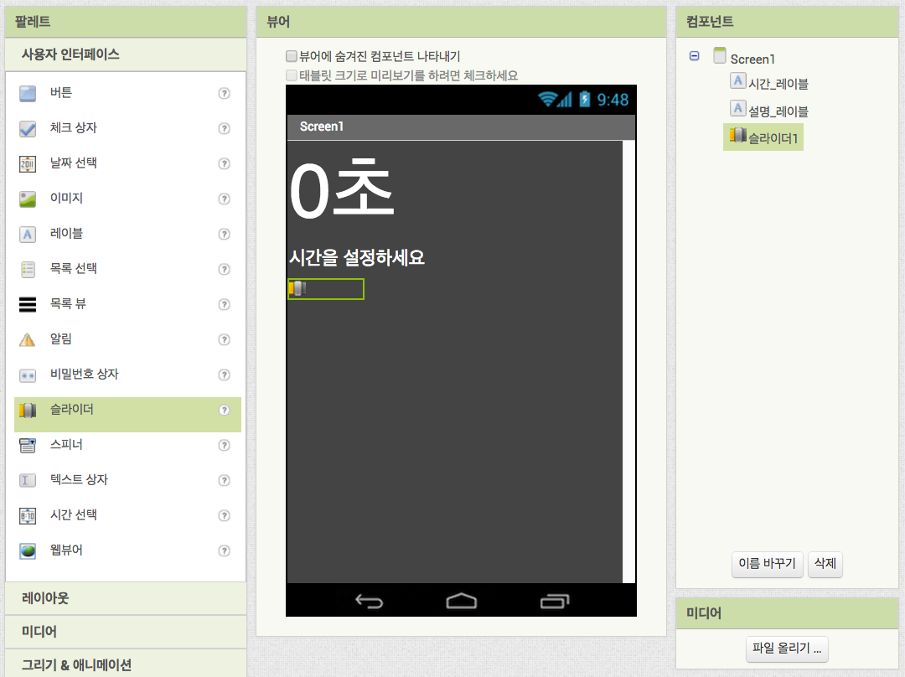
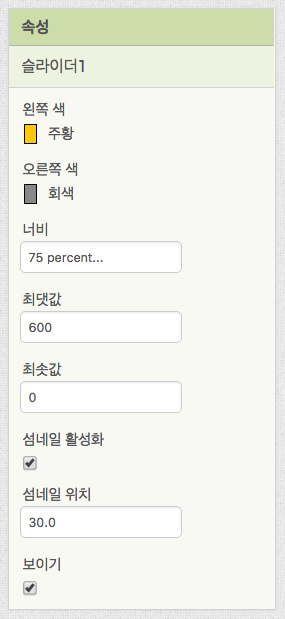

# 타이머 앱 만들기

## 개요

설정한 시간이 지나면 소리나 진동으로 알림을 주는 앱입니다.

## 제작 목표

* 변수를 이해하고 사용해 봅니다.
* 시계 컴포넌트의 타이머 기능을 사용하는 법을 익힙니다.
* 슬라이더 컴포넌트의 사용법을 익힙니다.

## 필요한 컴포넌트

| 컴포넌트 |  개수  |
| :--: | :--: |
| 레이블  |  2개  |
| 슬라이더 |  1개  |
|  버튼  |  1개  |
|  소리  |  1개  |
|  시계  |  1개  |

## 컴포넌트 추가하기

1. 배경색을 원하는 색으로 설정하겠습니다. 컴포넌트 창에서 Screen1을 선택하고 속성창을 봅니다. 배경색 항목을 찾아서 어두운 회식으로 설정합니다.  
   

2. 남은 시간을 표시할 레이블을 추가하겠습니다. 팔레트 창에서 [사용자 인터페이스]아래에 있는 [레이블]을 찾아보세요. 그리고 레이블 컴포넌트를 드래그하여 뷰어 창으로 가져다 놓아주세요.  
   

3. 뷰어 창에 컴포넌트를 추가했다면 해야할 일이 하나 있습니다. 컴포넌트의 새 이름을 지어주어야 합니다. 알기 쉽고 간단한 이름을 입력하세요. (예: 시간 레이블)  
   

   * 컴포넌트가 몇 개 없는 경우에는 문제가 없지만 컴포넌트의 수가 늘어나면 자신이 원하는 컴포넌트를 찾기가 어려워집니다. [블록 에디터]로 넘어가면 원하는 컴포넌트를 이름만 보고 찾아야 하므로 반드시 필요한 작업입니다.

4. 방금 추가한 "시간레이블"의 속성을 바꾸겠습니다. **글꼴 크기**는 80, **텍스트 색상**은 흰색, **텍스트** 내용은 "0초"라고 입력합니다.  
   

5. 이어서 설명 레이블도 추가합니다. 마찬가지로 팔레트 창에서 [사용자 인터페이스] 아래에 잇는 [레이블]을 끌어다 뷰어창에 놓습니다. 컴포넌트의 이름도 "설명 레이블"로 바꿔주세요. **글꼴 크기**는 20, **텍스트 색상**은 흰색 그리고 **텍스트**는 "시간을 설정하세요"라고 입력합니다.  
   

6. 슬라이더 컴포넌트를 추가하겠습니다. 팔레트 창의 [사용자 인터페이스] 목록에서 [슬라이더]를 끌어 뷰어 창에 놓습니다. 이 앱에서 슬라이더는 하나 뿐이므로 컴포넌트 이름을 굳이 바꾸지 않아도 됩니다.  
   

7. 슬라이더의 속성을 수정하겠습니다. **너비**는 75퍼센트, **최댓값**은 600, **최솟값**은 0으로 입력합니다.  
   

8.  

   ​

   ​