# 타이머 앱 만들기

## 개요

설정한 시간이 지나면 소리나 진동으로 알림을 주는 앱입니다.

## 제작 목표

* 변수를 이해하고 사용해 봅니다.
* 시계 컴포넌트의 타이머 기능을 사용하는 법을 익힙니다.
* 슬라이더 컴포넌트의 사용법을 익힙니다.

## 필요한 컴포넌트

| 컴포넌트 |  개수  |
| :--: | :--: |
| 레이블  |  2개  |
| 슬라이더 |  1개  |
|  버튼  |  1개  |
|  소리  |  1개  |
|  시계  |  1개  |

## 컴포넌트 추가하기

1. 배경색을 원하는 색으로 설정하겠습니다. 컴포넌트 창에서 Screen1을 선택하고 속성창을 봅니다. 배경색 항목을 찾아서 어두운 회식으로 설정합니다.  
   

2. 남은 시간을 표시할 레이블을 추가하겠습니다. 팔레트 창에서 [사용자 인터페이스]아래에 있는 [레이블]을 찾아보세요. 그리고 레이블 컴포넌트를 드래그하여 뷰어 창으로 가져다 놓아주세요.  
   

3. 뷰어 창에 컴포넌트를 추가했다면 해야할 일이 하나 있습니다. 컴포넌트의 새 이름을 지어주어야 합니다. 알기 쉽고 간단한 이름을 입력하세요. (예: 시간 레이블)  
   

   * 컴포넌트가 몇 개 없는 경우에는 문제가 없지만 컴포넌트의 수가 늘어나면 자신이 원하는 컴포넌트를 찾기가 어려워집니다. [블록 에디터]로 넘어가면 원하는 컴포넌트를 이름만 보고 찾아야 하므로 반드시 필요한 작업입니다.

4. 방금 추가한 "시간레이블"의 속성을 바꾸겠습니다. **글꼴 크기**는 80, **텍스트 색상**은 흰색, **텍스트** 내용은 "0초"라고 입력합니다.  
   

5. 이어서 설명 레이블도 추가합니다. 마찬가지로 팔레트 창에서 [사용자 인터페이스] 아래에 잇는 [레이블]을 끌어다 뷰어창에 놓습니다. 컴포넌트의 이름도 "설명 레이블"로 바꿔주세요. **글꼴 크기**는 20, **텍스트 색상**은 흰색 그리고 **텍스트**는 "시간을 설정하세요"라고 입력합니다.  
   

6. 슬라이더 컴포넌트를 추가하겠습니다. 팔레트 창의 [사용자 인터페이스] 목록에서 [슬라이더]를 끌어 뷰어 창에 놓습니다. 이 앱에서 슬라이더는 하나 뿐이므로 컴포넌트 이름을 굳이 바꾸지 않아도 됩니다.  
   

7. 슬라이더의 속성을 수정하겠습니다. **너비**는 75퍼센트, **최댓값**은 600, **최솟값**은 0으로 입력합니다. 최댓값은 슬라이더 섬네일(슬라이더 손잡이)을 왼쪽 끝으로 밀었을 때의 값이고 최솟값은 오른쪽 끝으로 밀었을 때의 값을 의미합니다.  
   

8. 다음은 타이머를 시작할 시작 버튼을 추가합니다. 팔레트 창의 [사용자 인터페이스] 목록에서 [버튼]을 찾아 뷰어창에 끌어다 놓습니다. 그리고 추가한 버튼 컴포넌트의 이름을 "시작버튼"으로 수정합니다. 
   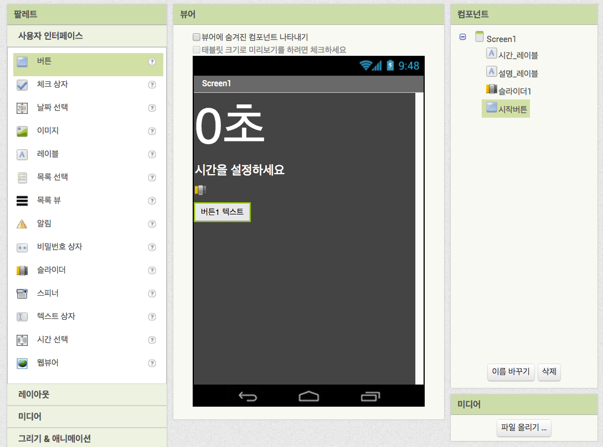

9. 버튼의 속성을 수정합니다. 버튼의 **배경색**은 흰색, **글꼴 굵게**를 체크, **글꼴 크기** 20,  **텍스트**를 "시작"이라고 입력하고 마지막으로 **텍스트 색상**을 어두운 회색으로 설정합니다.  
   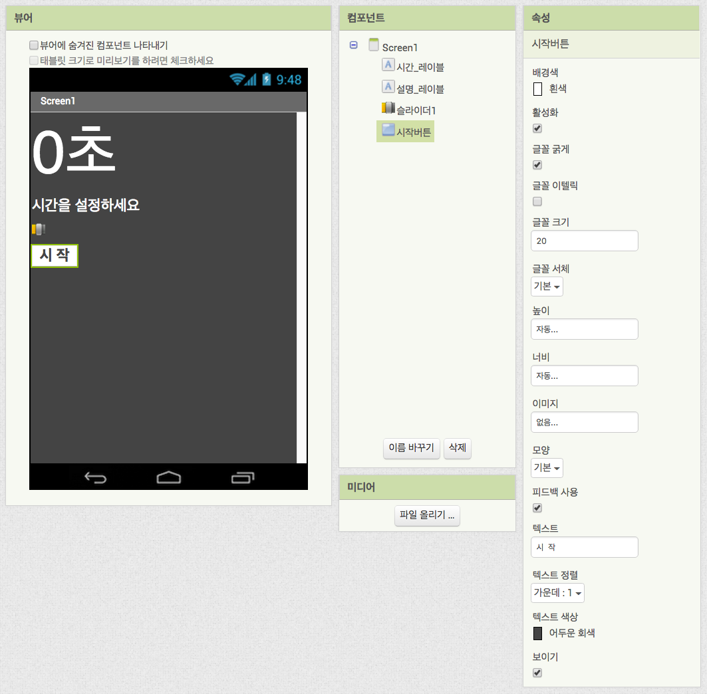

10. 타이머 기능을 사용하기 위해서 [시계] 컴포넌트를 가져오겠습니다. 팔레트 창 아래 [센서] 목록에 있는 [시계] 컴포넌트를 찾아 뷰어창에 드래그 합니다. [시계] 컴포넌트는 **보이지 않는 컴포넌트**라서 뷰어 창 안에 나타나지 않고 대신 아래에 별도로 표시됩니다. 그리고 컴포넌트 창에도 제대로 [시계] 컴포넌트가 추가된 것을 볼 수 있습니다.  
 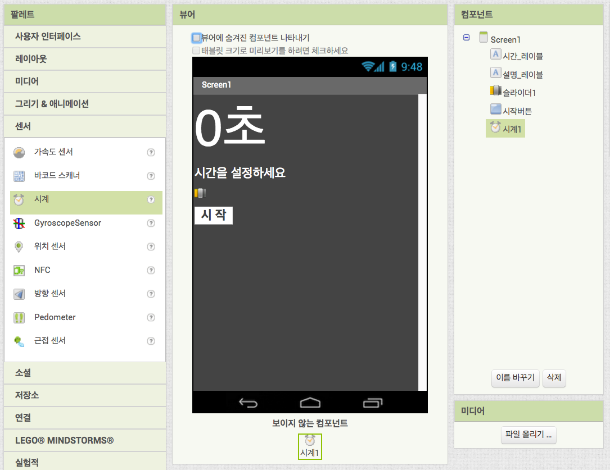

11. 이번에는 [소리] 컴포넌트를 추가합니다. 소리 컴포넌트는 팔레트 창의 [미디어] 목록에서 찾을 수 있습니다. [소리] 컴포넌트를 뷰어 창에 끌어다 놓습니다. [소리] 컴포넌트도 [시계] 컴포넌트와 마찬가지로 **보이지 않는 컴포넌트**입니다.  
    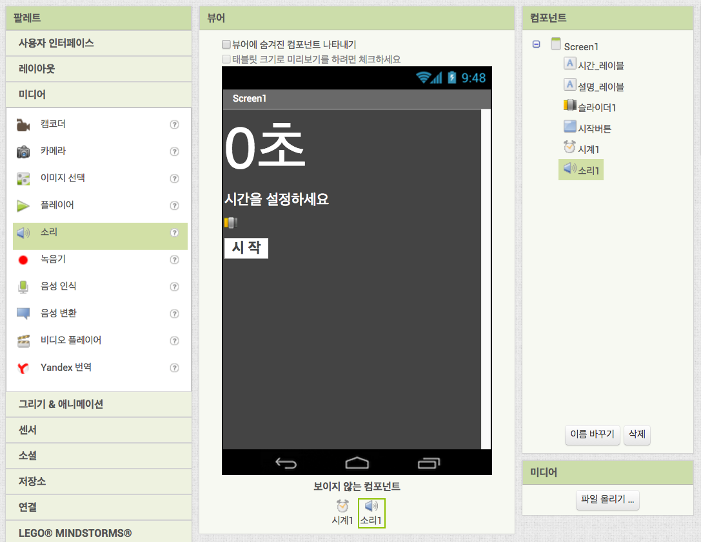

12. 추가한 소리 컴포넌트가 어떤 소리를 내게 할 것인지 설정하겠습니다. 추가한 "소리1" 컴포넌트를 선택하고 속성 창을 봅니다. **소스**항목이 "없음…"으로 표시되어 있습니다. 이곳을 클릭합니다. 그리고 [파일 올리기…] 버튼을 눌러 새로 뜨는 창에서 [Choose File] 버튼을 눌러 원하는 소리 파일을 찾아준 다음 [확인] 버튼을 누릅니다.  
    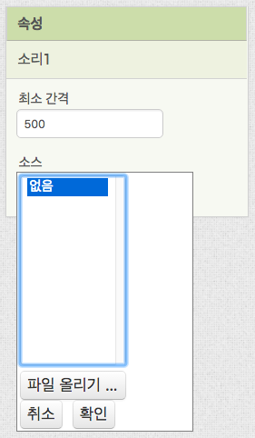 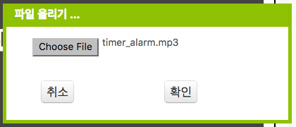

13. 필요한 컴포넌트는 모두 추가하였고 미디어 파일도 준비가 되었습니다. 그런데 한 가지 더 설정해야 하는 것이 있습니다. 뷰어에 추가된 컴포넌트들이 모두 왼쪽 상단에 몰려있는데, 이것을 화면 가운데에 정렬 하고자 합니다. 컴포넌트 창에서 추가한 컴포넌트들을 감싸고 있는 [Screen 1]을 선택하여 속성 창을 열어봅니다. 여러 항목들 중 **수평 정렬**과 **수직 정렬** 항목을 각각 "중앙"과 "가운데"로 선택합니다.  
    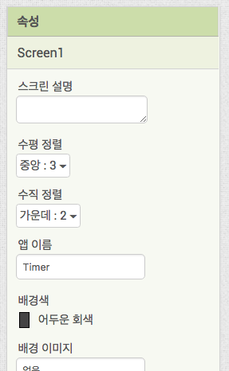

14. 그러자 추가된 컴포넌트들이 화면 가운데에 정렬된 것을 볼 수 있습니다.  
    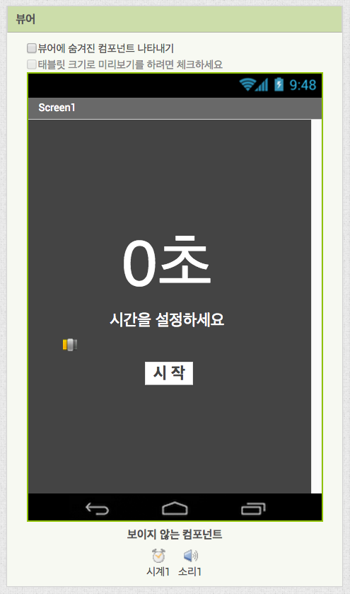

15. [디자이터 에디터]에서 할 일은 모두 끝났습니다. 이제 [블록 에디터]로 넘어가서 타이머의 기능을 완성해 보도록 하겠습니다. 화면 오른쪽 상단에 있는 [블록] 버튼을 눌러주세요.  
    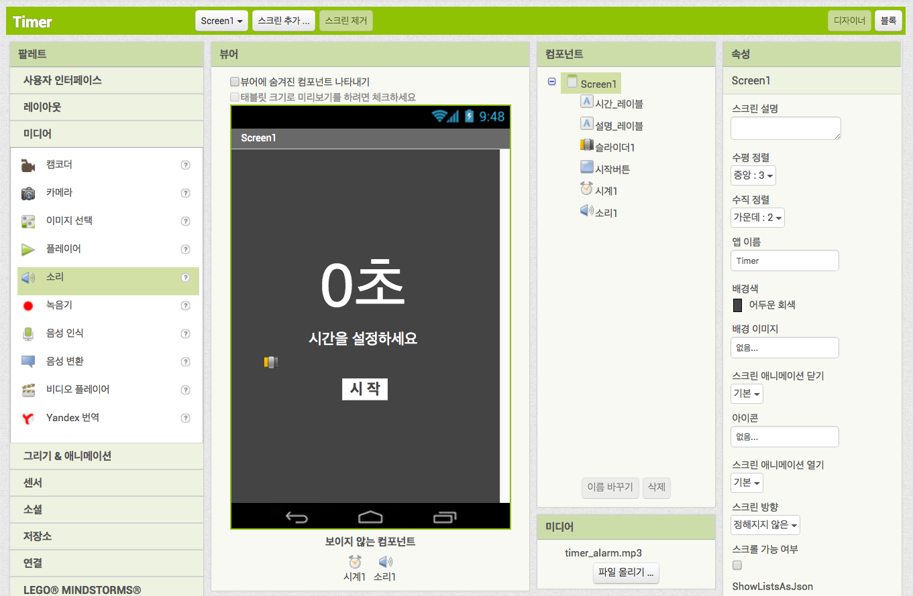

    ​

## 블록으로 프로그래밍 하기

블록으로 프로그래밍을 하기 전에 타이머 앱이 어떻게 동작할 것인지 생각해봅시다. 일반적으로 타이머라고 하면 다음의 순서대로 동작할 것입니다.

1. 앱을 실행한다.
2. 시간을 설정한다.
3. 타이머를 시작한다.
4. 남은 시간이 0초가 되면 알림을 준다.

위 순서를 잘 기억하면서 하나씩 기능을 만들어 보겠습니다.

### 1. 앱 초기화

사용자가 시작 버튼을 누르지도 않았는데 제멋대로 동작하면 안되겠지요? 앱이 처음 실행하고나면 사용자가 타이머를 사용할 수 있도록 준비하고 있어야 합니다. 

1. 블록 창에서 [Screen 1] 컴포넌트를 클릭하여 블록들을 꺼내봅니다. 그 중에서 [언제 Screen 1. 초기화]라는 블록을 뷰어 창에 끌어다 놓아주세요.  
   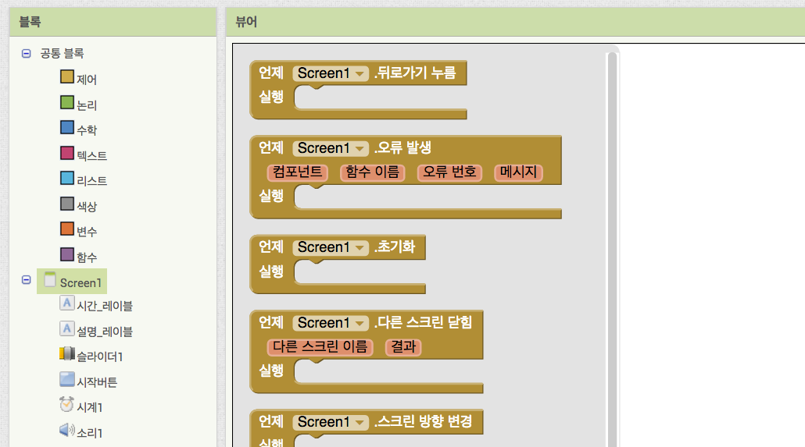
2. 이 블록은 앱이 처음 실행될 때 한 번만 동작하는 블록입니다. 사용자가 타이머 앱을 사용할 수 있도록 준비하는 내용이 들어가야 합니다. 우선 타이머가 저절로 움직이면 안되므로 확실하게 타이머를 멈춰주는 블록을 끼워넣도록 하겠습니다.  
   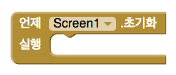
3. 블록 창에서 [시계1] 컴포넌트를 클릭하여 [시계1]에 속해있는 블록들을 열어봅니다. 많은 블록들 중에서 타이머를 멈춰주는 블록을 찾아보겠습니다. 마우스 스크롤을 이용해서 아래로 내려가면 짙은 초록색 블록들이 보입니다. 짙은 초록색 블록은 타이머의 속성 값을 설정하는 블록인데 지금 필요한 것은 [**지정하기** 시계1.타이머 활성 여부] 블록입니다. 이 블록을 꺼내어 앞서 꺼내놓은 Screen1 초기화 블록에 끼워줍니다.  
   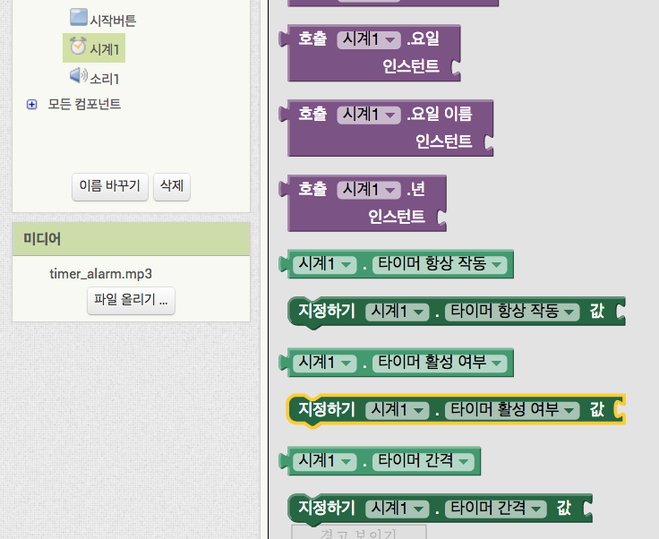 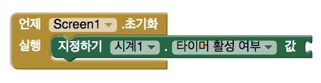
4. 이 상태로는 아직 타이머가 작동해야하는지 안해야하는지 알 수 없습니다. [지정하기 시계1.타이머 활성 여부]라는 블록을 잘 살펴보면 오른쪽 끝에 "값"이라고 적혀있고 추가로 블록을 끼워넣을 수 있게 만들어져 있습니다. 이곳에 [거짓]이라는 블록을 끼워넣으면 타이머가 멈춰집니다. [거짓]블록은 블록 창에서 [공통 블록] 아래에 있는 [논리]를 클릭하면 찾을 수 있습니다.  
   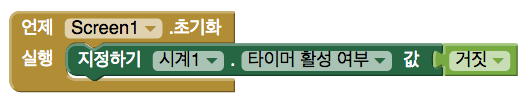
5. 다음은 앱이 실행 되었을 때 남은 시간은 0초로 나타나고 남은 시간에 맞게 슬라이더 위치도 0의 위치로 옮겨지도록 하겠습니다. 그러기 위해서 우선 타이머의 남은 시간 값을 임시로 저장하기 위해서 '변수'라는 것을 이용하겠습니다. 블록 창의 [공통 블록] 아래 [변수] 항목을 눌러 변수와 관련된 블록들을 열어봅니다. 그 중 [전역변수 초기화]라는 블록을 끌어다 뷰어 창에 놓습니다.  
   
6. 변수는 이름을 지어줄 수 있습니다. 블록을 살펴보면 글씨의 색이 다른 부분이 있습니다. 이곳을 클릭하여 이 변수의 이름을 "남은 시간"이리고 수정해줍니다.  
   
7. 그런 다음 이 변수의 초기화값으로 숫자 0을 넣어줍니다. 숫자를 입력하기 위해서 블록 창의 [공통 블록] 아래 [수학] 항목을 눌러봅니다. 수학에 관련한 많은 블록들을 볼 수 있을텐데요, 맨 위에 "0"이라는 숫자가 적혀있는 작은 블록을 끌어다 변수 값에 끼워 넣습니다.  
   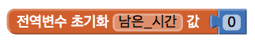
8. 이제 이 변수를 이용해서 [시간 레이블]에 "0초"라는 텍스트가 표시되도록 하겠습니다. 블록 창에서 [시간 레이블]를 클릭한 다음 짙은 초록색 블록 중 [**지정하기** 시간 레이블.텍스트]라는 블록을 찾아 [**언제** Screen1**.초기화**] 블록에 안으로 가져옵니다.  
   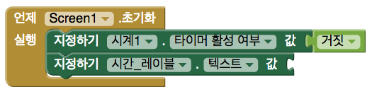
9. 변수 [남은 시간]의 값을 가져오도록 하겠습니다. 값을 가져오는 방법은 두 가지가 있습니다. 하나는 볼록 창에서 [공통 블록] 아래 [변수] 항목을 클릭하여 [**가져오기**] 블록을 끌어다 놓고 이름 부분을 눌러 원하는 변수 값을 선택하는 방법입니다. 두 번째 방법은 앞서 만든 [**전역변수 초기화** 남은 시간] 블록의 이름 부분에 마우스를 놓고 기다리면 뜨는 블록을 가져오는 방법입니다.  
   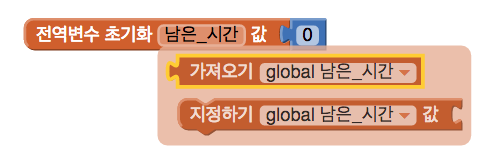
10. 이 [**가져오기** global 남은 시간] 블록을 [**지정하기** 시간 레이블.텍스트] 블록의 값에 끼워넣습니다. 그러면 [시간 레이블]의 텍스트 값이 "0"이 됩니다.   
    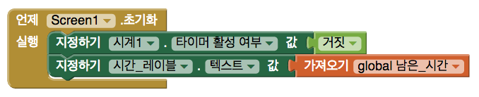
11. 하지만 우리가 원했던 텍스트는 "0초"였습니다. 뒤에 "초"라는 글자가 더해져야 합니다. 이를 위해서는 텍스트를 다루는 블록을 사용합니다. 블록 창에서 [공통 블록] 아래 [텍스트]라는 항목이 있습니다. 클릭 해보면 텍스트를 다룰 수 있는 블록들이 나타나는데 이 중에서 [**"**  **"**]라는 빈 텍스트 블록을 가져옵니다.  
    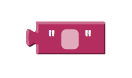
12. 그 다음 다시 [텍스트]항목을 눌러 [**합치기**]라는 블록을 꺼내옵니다. 이 블록은 입력된 여러 텍스트를 하나의 텍스트로 합쳐주는 역할을 합니다. 첫번째 값으로는 변수 [남은 시간]의 값을 끼워주고, 두 번째 값에다가 바로 앞에서 꺼내온 빈 텍스트 블록을 끼워 넣습니다. 그리고 빈 텍스트 블록의 빈 부분을 클릭하여 우리가 원하는 "초"라는 글자를 입력합니다. 이렇게 해서 [시간 레이블]의 텍스트 값이 "0초"라는 값으로 초기화 할 수 있게 되었습니다.
    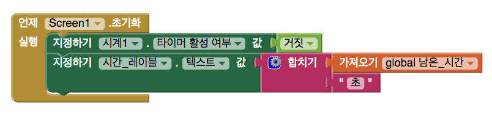
13. 초기화 작업의 마지막으로 [슬라이더1]의 섬네일 위치를 0으로 맞춰주도록 하겠습니다. 블록 창에서 [슬라이더1] 컴포넌트를 클릭하여 짙은 초록색 블록인 [**지정하기** 슬라이더1.섬에일 위치] 블록을 찾습니다. 이 블록을 [[**언제** Screen1**.초기화**] 속에 집어 넣습니다.  
    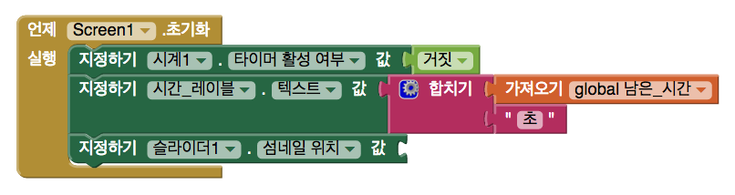
14. [**지정하기** 슬라이덥.섬네일 위치] 블록에 변수 [남은 시간]의 값을 입력하도록 합니다. 앞서 했던 방법과 똑같이 [**가져오기** global 남은 시간] 블록을 꺼내와 입력합니다.  
    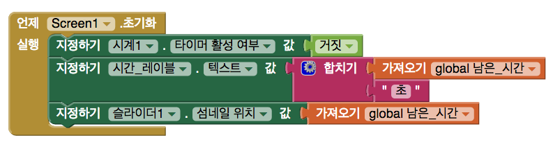
15. 이렇게해서 타이머 앱의 초기화 작업을 모두 끝냈습니다. 다음은 슬라이더 섬네일을 움직여서 시간을 설정하는 방법을 설명하겠습니다.

### 슬라이더로 시간 설정하기

